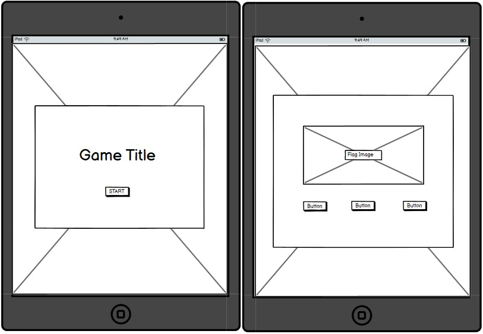
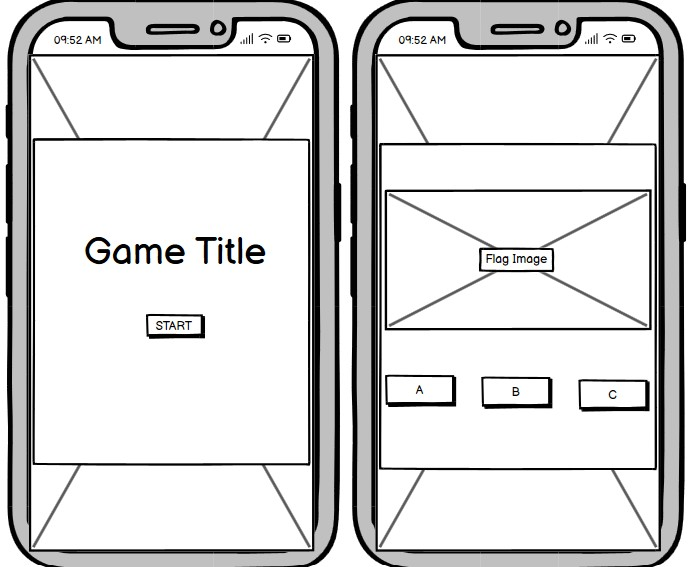

# Milestone Project 2 (FLAGTASTIC MISSION)

Flagtastic Mission is a fun and interactive flag quiz game designed to test and enhance players' knowledge of world flags. The game consists of two levels:

- **Level 1**: Players answer five multiple-choice questions, identifying the correct flag from three options. Each question allows **two attempts** before the game ends.
- **Level 2**: Adds a **timer challenge**, where players must answer each question within **60 seconds** to progress.

With engaging gameplay and a simple yet dynamic interface, this game is perfect for casual gamers, geography enthusiasts, and young children. This game aims to provide an enjoyable learning experience while challenging to improve their geography skills.

# UX

---

### Landing Page

The landing page is the first thing players see, setting the tone with a sleek, retro-futuristic design reminiscent of the movie _Guardians of the Galaxy_.

- A straightforward layout ensures focus on the **Start** button.
- Orbitron font style to match the high-tech and space-inspired style seen in the movie.
- The chosen colours and design elements mirror the glow effect and intergalactic setting of the film.

### Game Layout

Once the game starts, the game layout carries the same cosmic, sci-fi aesthetic, making players feel like they're on an intergalactic mission to identify flags from different planets (in this case, **COUNTRIES**).

- The flag image is prominently displayed in a glowing container border to emphasise the futuristic theme.
- Answer choices buttons are style with high contrast, making selections feel interactive and engaging.
- a sci-fi themed modal displaying information when the game ends.

---

### Player Goals

- Test and improve knowledge of world flags.
- Successfully complete Level 1.
- Conquer Level 2 by answering question within a minute.
- Aim for the highest possible score.
- Enjoy a smooth and interactive gameplay experience with instant feedback and progression tracking.

### Developer Goals

- Build a fully functional and responsive quiz game using HTML, CSS and JavaScript.
- Implement a two-level game structure, with a timed challenge in Level 2.
- Provide clear user feedback through visual cues and messages.
- Ensure an intuitive UI/UX, keeping gameplay engaging and accessible on different devices.

## User Stories

As a **Player**, I want to:

1. Start the game easily from a landing page.
2. Choose the correct flag from three options.
3. Receive instant feedback on my answer selection.
4. Have a chance/s to correct mistakes.
5. See a countdown timer in Level 2 for an added challenge.
6. View my score at the end of the game.
7. Restart the game easily if I lose or complete it.

As a **Developer**, I want to:

1. Ensure the game mechanics work smoothly for an enjoyable experience.
2. Structure the code with clear function and event listener for easy debugging.
3. Design a responsive interface that works on desktop, tablet, and mobile.
4. Implement a modal-based feedback system to notify players of game status.
5. Use CSS effects to enhance the visual appeal.

## Upcoming Features

- **Shuffling Question**- questions will appear in a random order to enhance replayability and challenge player with different flags each time they play.
- **API Integration**- instead of using static data, the game may fetch flag images and country names dynamically from an API, allowing for a broader and more diverse set of questions.

## Design Choices

The overall design of the game is inspired by the **Guardians of the Galaxy** movie, incorporating a futuristic and space-themed aesthetic. Despite its cosmic feel, the game remains firmly focused on the geographical context, challenging players to test their knowledge of world flags in an engaging and immersive way.

## Wireframe

These wireframes screenshots illustrate the responsive design, showcasing the desktop, tablet, and mobile layouts.

- **Desktop**

- **Tablet**

- **Mobile**

## Font

[Google Font](https://fonts.google.com/) library was used for this site. The ["Orbitron"](https://fonts.google.com/specimen/Orbitron) font style was chosen for its futuristic and bold appearance, which enhances the game's theme and makes text stand out clearly. Its modern design complements the engaging and interactive nature of the flag quiz, making the game more visually appealing.

## Colour Scheme

The colour palette for this game was generated using [Adobe Color](https://color.adobe.com/create/image) to ensure a visually appealing and cohesive design. Each colour was carefully chosen to enhance readability, engagement, and the overall gaming experience.

- #CD7F32 (Bronze Gold - Used for Text and Headings)
- #4D5159 (Dark Gray - Used for Buttons and UI Elements)
- #FFFFFF (White - Used for Text on Dark Backgrounds)
- Background Image - The game background features an image that blends well with the chosen colours, enhancing the immersive experience while keeping the focud on the main game elements.

This colour scheme was selected to provide a modern, engaging, and visually comfortable experience for players while maintaining a balance between contrast and aesthetics.

## Technologies Used

- [HTML](https://en.wikipedia.org/wiki/HTML): Utilised for structuring the main site content.

- [CSS](https://en.wikipedia.org/wiki/CSS): Applied for styling the website.

- [JavaScript](https://en.wikipedia.org/wiki/JavaScript): The core programming language of the game, handling logic, user interactions and gameplay mechanics.

- [VS Code](https://code.visualstudio.com/): The main editor used for development and providing extensions for an efficient workflow.

- [GitHub](https://github.com/): Used for secure online code storage and pages deployment of the website.

- [Markdown](https://en.wikipedia.org/wiki/Markdown): Used to write and format documentation efficiently with a clean and structured layout.

## Testing

All testing conducted for this project has been documented in separate file [TESTING.md](TESTING.md). This includes:

- Validation: code checked for [HTML W3C validator](https://validator.w3.org/), [CSS Jigsaw](https://jigsaw.w3.org/css-validator/) and [JavaScript JSHint](https://jshint.com/) were used.

- Lighthouse Testing: google lighthouse was used to test the site's Performance, Accessibility, and Best Practices.

- Responsiveness: ensuring the site function seamlessly across various devices using tools such as Chrome DevTools.

- Browser Compatibility: Validating compatibility on popular browsers, cluding Chrome, Firefox, Opera and Edge.

## Deployment

This concise guide covers the essential steps for deployment.

Steps to deploy a project on Github pages:

1. Navigate to your Github repository.
2. Click on the **Settings** tab at the top of the reposiroty page.
3. In the left-hand menu, select **Pages** under the Code and Automation.
4. Under the Source section, choose the branch you want to deploy which is **main**, and select the folder **/root** for deployment.
5. Click **Save**.
6. After a few moments, **Github Pages** will provide a live URL where your site is hosted.

Steps to Create a Github Account

1. Go to GitHub: visit [github.com](https://github.com/) and click Sign up in the top right corner.
2. Enter Details: provide email and password.
3. Verify Account: complete the captcha to verify you're human.
4. Choose a plan: select the free plan.
5. Verify Email: check your email and click the verification link.
6. Set up Profile: this is optional. Add you name, photo, etc.
7. Start using Github

Steps to Run the Project in VS Code

1. Launch **Visual Studio Code** on your computer.
2. Open the Project Folder by clicking on **File** > **Open Folder** and select the folder containing the game files.
3. Option **1**: Run the Project using Python HTTP Server: Open the **Terminal** in VS Code, type "python3 -m http.server" or "python -m http.server --bind 127.0.0.1" > holding the CTRL key + click the URL (http://127.0.0.1:8000/) in the terminal.
4. Option **2**: If you haven't installed **Live Server**, go to the **Extensions** panel, search for **Live Server** and install it. Open **index.html**, right-click anywhere in the file and select **Open with Live Server** to preview the game.
