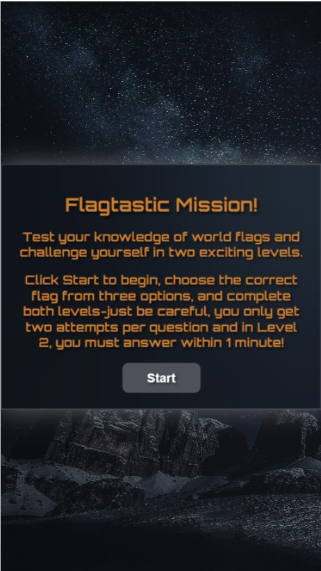
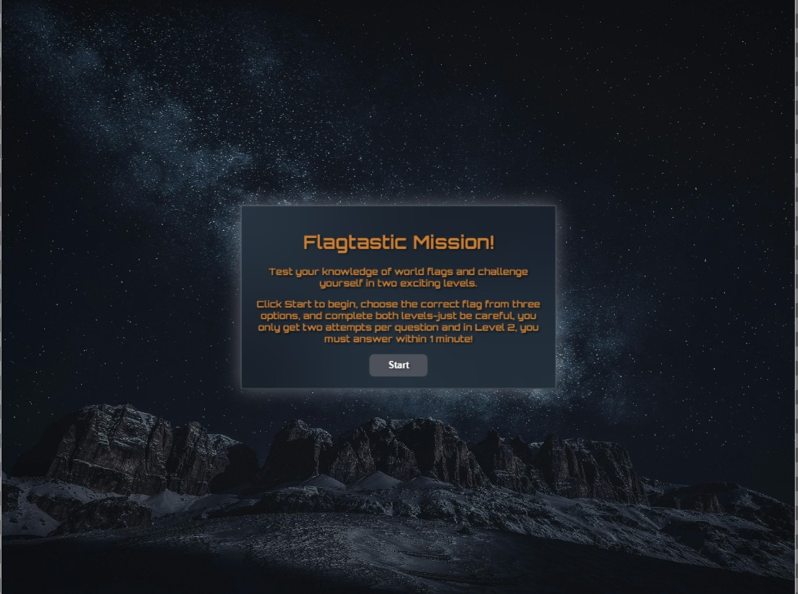
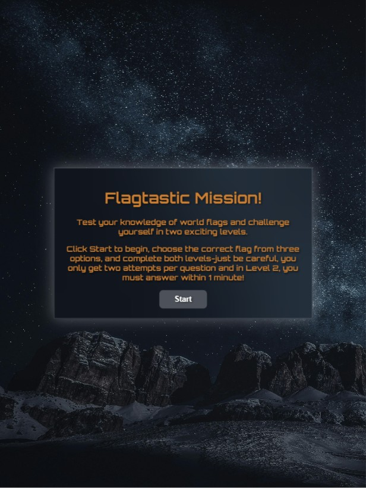
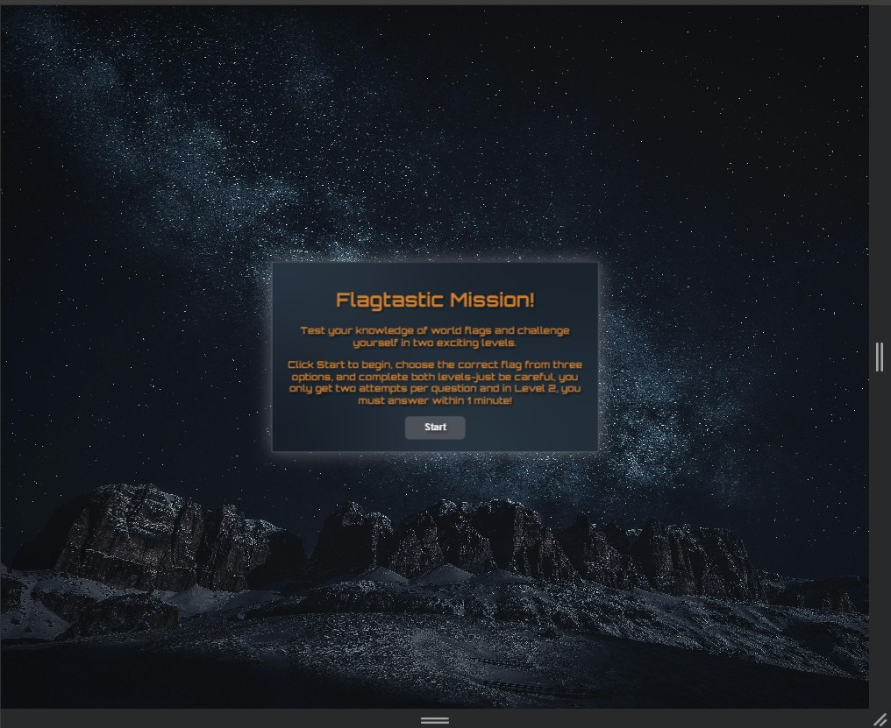
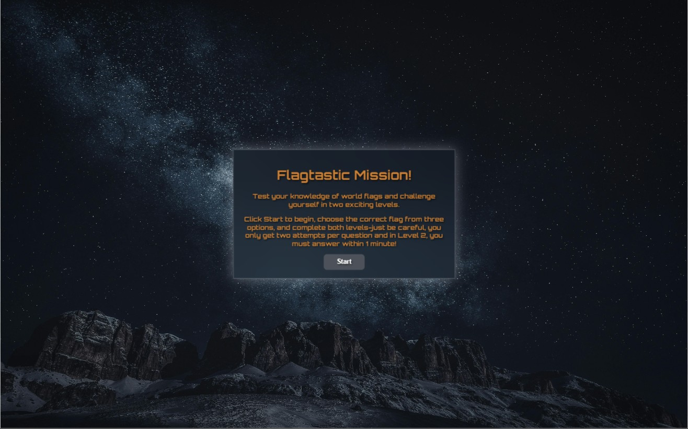

# TESTING

## Code Validation

To validate all HTML files, the recommended validator service by Code Institute which is [HTML W3C](https://validator.w3.org/) was used.

| Validator                        | Comment  | Screenshot                         |
| -------------------------------- | -------- | ---------------------------------- |
| [W3C](https://validator.w3.org/) | No Error |  |

To validate the CSS file, the recommended validator service by Code Institute which is [Jigsaw W3C](https://jigsaw.w3.org/css-validator/) was used.

| Validator                                          | Comment  | Screenshot                        |
| -------------------------------------------------- | -------- | --------------------------------- |
| [Jigsaw W3C](https://jigsaw.w3.org/css-validator/) | No Error |  |

To validate the JavaScript file, the recommended validator service by Code Institute which is [JSHint](https://jshint.com/) was used.

| Validator                                | Comment  | Screenshot                       |
| ---------------------------------------- | -------- | -------------------------------- |
| [JavaScript JSHint](https://jshint.com/) | No Error |  |

## Lighthouse Testing

Lighthouse was used to evaluate the website's performance, accessibility and best practices. This testing ensures the site meets modern web standards and provides an optimised user experience accross devices.

| Device  | Comment                | Screenshot                                                                   |
| ------- | ---------------------- | ---------------------------------------------------------------------------- |
| Desktop | minor warning          |                                        |
| Mobile  | some warnings as shown |   |

## Responsiveness

Flagtastic Mission is designed to be fully responsive across various screen seizes, ensuring a smooth and engaging experience on desktops, tablets, and mobile devices. The layout adapts dynamically, with buttons and text adjusting for readability and usability.

| Device                          | Comment                        | Screenshot                                                |
| ------------------------------- | ------------------------------ | --------------------------------------------------------- |
| Iphone 414 x 736                | Achieves desired functionality |                    |
| Google Pixel 411 x 731          | Achieves desired functionality |              |
| Ipad Pro 1366 x 1024            | Achieves desired functionality |                  |
| Amazon Kindle Fire 768 x 1024   | Achieves desired functionality |             |
| Laptop 1440px (Chrome DevTools) | Achieves desired functionality |  |
| 22" Desktop 1920 x 1080         | Achieves desired functionality |           |

## Browser Compatability

Flagtastic Mission has been tested across multiple modern web browsers, including **Google Chrome**, **Mozilla Firefox**, **Microsoft Edge**, and **Opera**. The game functions as intended, with consistent styling and interactive elements.

| Browser     | Screenshot                              |
| ----------- | --------------------------------------- |
| **Chrome**  |  |
| **Firefox** |       |
| **MS Edge** |       |
| **Opera**   |           |
