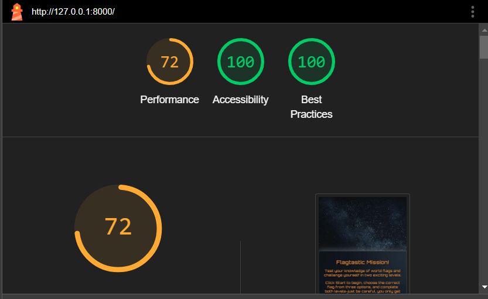

# TESTING

## Code Validation

To validate all HTML files, the recommended validator service by Code Institute which is [HTML W3C](https://validator.w3.org/) was used.

| Validator                        | Comment  | Screenshot                         |
| -------------------------------- | -------- | ---------------------------------- |
| [W3C](https://validator.w3.org/) | No Error |  |

To validate the CSS file, the recommended validator service by Code Institute which is [Jigsaw W3C](https://jigsaw.w3.org/css-validator/) was used.

| Validator                                          | Comment  | Screenshot                        |
| -------------------------------------------------- | -------- | --------------------------------- |
| [Jigsaw W3C](https://jigsaw.w3.org/css-validator/) | No Error |  |

To validate the JavaScript file, the recommended validator service by Code Institute which is [JSHint](https://jshint.com/) was used.

| Validator                                | Comment  | Screenshot                       |
| ---------------------------------------- | -------- | -------------------------------- |
| [JavaScript JSHint](https://jshint.com/) | No Error |  |

## Lighthouse Testing

Lighthouse was used to evaluate the website's performance, accessibility and best practices. This testing ensures the site meets modern web standards and provides an optimised user experience accross devices.

| Device  | Comment                | Screenshot                                                                   |
| ------- | ---------------------- | ---------------------------------------------------------------------------- |
| Desktop | minor warning          |                                        |
| Mobile  | some warnings as shown |   |
